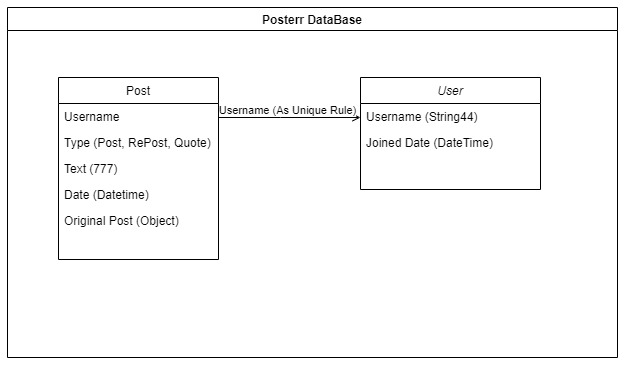

# Posterr

Mad with Flask, MongoDB and Docker. Dockerfile is also available to make docker image and docker containers.

My name is Gabriel, So I'll explain how I thought to build this project:
```
       On the first step I was thinking something to have good Performance and be Scalable 
       and "What the data the project will need and how I will have the control ?"
    So, with these thinking I Decided to use a NoSql Database even the data talk each other, I think could be 
    a good Ideia because, if in a near future need implements something new will not be a problem to new changes 
    considering the quantity of users and posts.
    And thinking this, below is the DataBase Modeling
```
## Database Modeling


```
After create Database Modeling.
        Now it's time to decide the architecture. This is one of the hard choices to do, because this decision will
    reflect also the performance, understanding and scalability of the project. 
    Then to serve these requirements, I decided use concepts of Clean Architecture, as the project is not something with big rules and 
    implementations and fits the needs.
```


## Built using :
```sh
	Flask : Python Based mini-Webframework
	MongoDB : Database Server
	Pymongo : Database Connector ( For creating connectiong between MongoDB and Flask )
```

## Set up environment for using this repo (ubuntu, Mac, Win):
```
Install Python ( If you don't have already )
	$ sudo apt-get install python
Install MongoDB ( Make sure you install it properly )
	$ sudo apt install -y mongodb

Windows:
    Install Python 3.9 from https://www.python.org/downloads/

    Install MongoDB from https://docs.docker.com/desktop/install/windows-install/

    Install MongoDB from https://www.mongodb.com/docs/manual/tutorial/install-mongodb-on-windows/
    
    
In Windows use Git bash: https://git-scm.com/downloads
Install Dependencies of the application
    in root project:
    $ py -m pip install virtualenv
    $ py -m venv venv
    
    Active venv
    windows: source venv/Scripts/activate
    linux: source venv/bin/activate
    
    Then:
    $ pip install -r app/requirements.txt
```

## Run the application
```
On Linux/Mac (in windows if you follow the tutorial in mongo website, will start when turn on your computer):
Start MongoDB
	$ sudo service mongod start
Start Docker
    $ sudo service docker start    

Start Application:
    $ docker-compose build
    $ docker-compose up
    if you don't want to see the logs run ( docker-compose up -d)
Stop Application:
    $ CTRL + C or docker-compose down
```

## Run the Unnit tests

```
After Start Application:
    $ docker exec -it posterr_web pytest
```

## Makefile

```
If you prefere you can prepare environment and use project by make commands:
Commands
    $ make setup
    $ make build
    $ make up
    $ make down
```

## Collection Postman
```
The file Posterr.postman_collection.json is a postman collection
Import the file in your postman for real tests

Important: For all get requisitions we pass the user on header
Folder - Profile
            - Get Profile you can paginate(See the params)
            - Create Profile
            - Create Post From Profile
       - Home
            - Home (params to page)
            - Home Only-Mine(with params to only mine)(See the params)
            - Home with date_range [Dates must be Like '2022-07-17 00:00:00' or '2022-07-17'] (See the params)
            - Create Post From Home
       - Post
            - Create post
            - Create repost
            - Create quote-post
           
 
Dates must be Like '2022-07-17 00:00:00' or '2022-07-17'

If page not informed we pass the lastest 10

About the scrolling HomePage/Profile. I did thinking on in front-end requests, 
whenever the user reaches the bottom of page so it pass the param page.
```